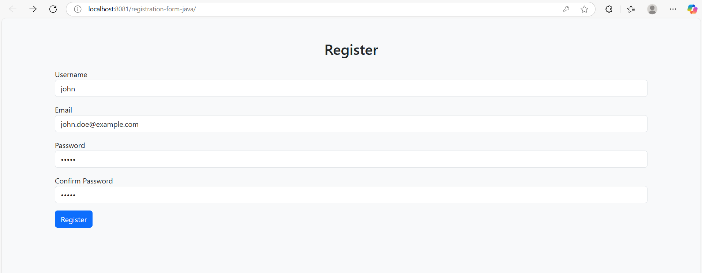
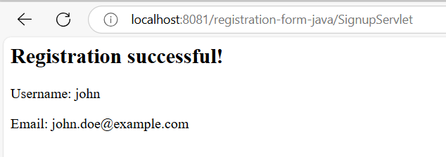
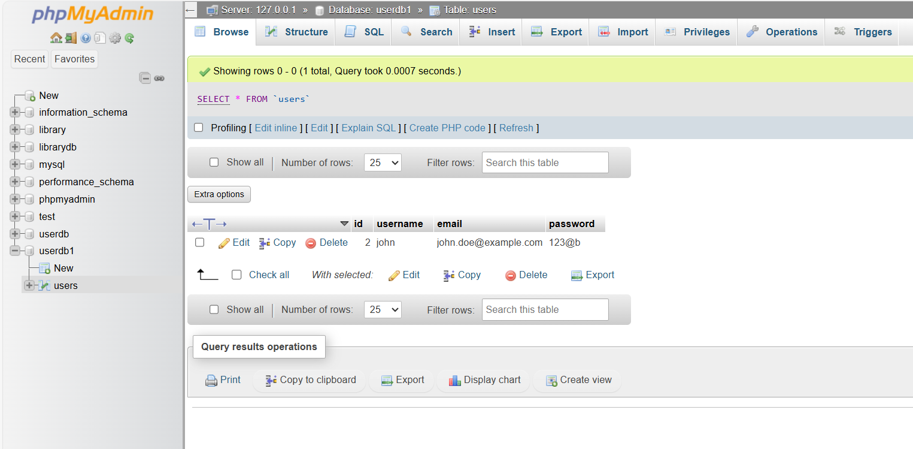

# Java Registration Form Web App

A simple Java web application that demonstrates a user registration form with input validation and database connectivity using MySQL.

---

## 🚀 Features

- Register with username, email, and password
- Input validation (username format, special character in password, match check)
- Data saved in MySQL database
- User-friendly UI with Bootstrap styling

---

## 📷 Screenshots

### Registration Form

### Successful Registration

### Database Entry

---

## 🛠️ Built With

- **Java EE (Servlets, JSP)**
- **NetBeans IDE**
- **MySQL Database**
- **Bootstrap 5**
- **Git & GitHub**

---

## 📂 Project Structure

- `web/index.jsp` — Registration form interface
- `src/java/SignupServlet.java` — Servlet handling validation & DB logic
- `README.md` — Project overview and instructions

---

## ✅ How to Run

1. Clone this repository.
2. Open in NetBeans.
3. Make sure MySQL is running with `userdb1` and `users` table.
4. Run the project on Tomcat or GlassFish.

---

## 👤 Author

**Mohamed Fihaas**  
📫 [LinkedIn](www.linkedin.com/in/mohamed-fihaas) | 🌐 [GitHub](https://github.com/fihaasac)

---

